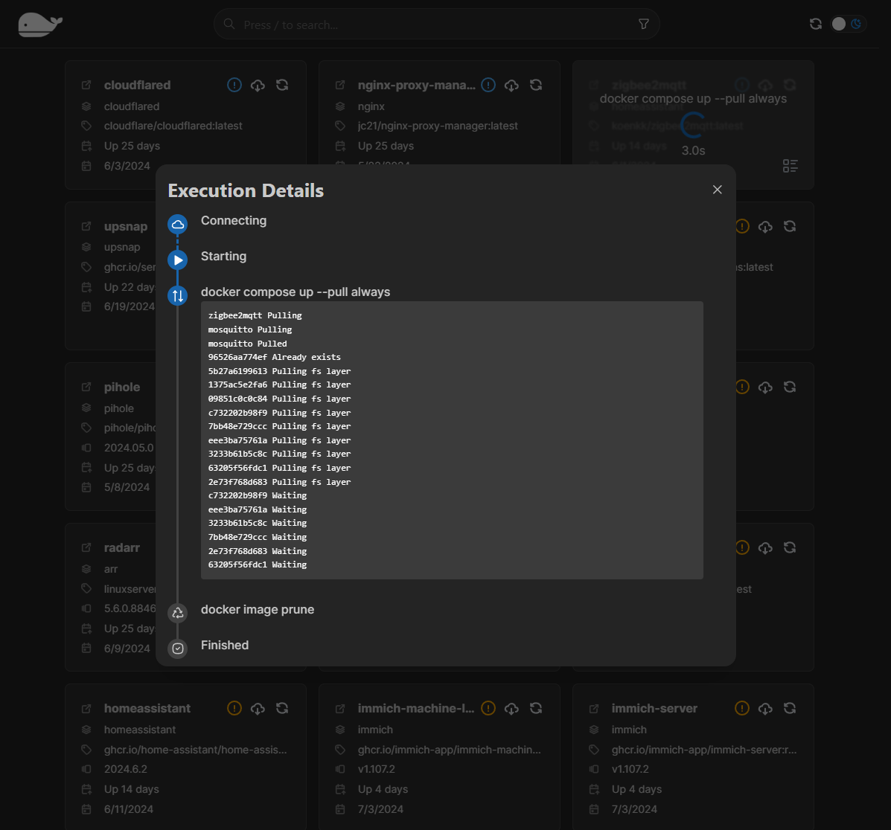
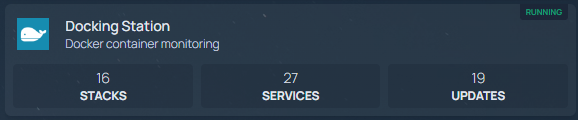

# Docking Station

Docking station is a webapp for managing and updating your docker containers. It is built using Nextjs and FastAPI.

This project started as a personal project to manage my docker containers, any and all contributions and feedback are welcome.

## Features

Check [settings.template.yml](./settings.template.yml) for a list of all available settings.

- cache_control_max_age
  - Time in seconds to cache the response
  - Accepts human readable suffixes (e.g. `1h`, `1d`, `1w`)
- discovery_strategy
  - `opt-out` - whitelist mode (default)
  - `opt-in` - blacklist mode
  - Use `com.loolzzz.docking-station.enabled` label to enable/disable service discovery
- ignore_compose_stack_name_keywords
  - List of regex patterns to ignore when discovering services
- possible_homepage_labels (Order matters!)
  - List of labels with possible links to image's homepage
- possible_image_version_labels (Order matters!)
  - List of labels with possible value for image's version
- time_until_update_is_mature
  - Time in seconds until an update is considered mature
  - Accepts human readable suffixes (e.g. `1h`, `1d`, `1w`)
- Auto-updater: **(NOT TESTED - Use at your own risk)**
  - Disabled by default
  - interval
  - max concurrent

## Technical Details

### Update Strategy

In order to properly update each stack, Docking Station tries to discover the stack's docker-compose file by [looking at the labels](./docking-station-app/src/app/api/services/docker.py#L331) of the stack's services.  
More specifically, it takes the `config_files` value and tries to `docker compose -f <config_file> up --pull always` the stack.

Moreover, Docking Station [tries to discover](./docking-station-app/src/app/api/services/docker.py#L333) the stack's envfile, if any, by looking for `.env` files at the same directory as the docker-compose file.

### Dockerhub API Rate Limit

Dockerhub has a [rate limit](https://docs.docker.com/docker-hub/download-rate-limit/) on how much you can query their API.  
To work around this, Docking Station caches the results of the API calls and only queries Dockerhub when the cache expires.

You are able to force a refresh of the cache by clicking the refresh button on the service's page.

### Maturity Period

Each update is given a maturity peroid based on the time since the image was last updated,  
Inspired by [dockcheck](https://github.com/mag37/dockcheck) `-d` option

Swagger UI documentation is available at `/docs`

## Screenshots

[video.webm](https://github.com/user-attachments/assets/589b6b21-bfd9-4666-bb13-f1bb25431fe2)




## Installation

### Using docker-compose (recommended)

```yaml
services:
  docking-station:
    image: loolzzz/docking-station
    restart: unless-stopped
    # environment:
    #   - WEB_PORT=3000
    #   - SERVER_PORT=3001
    ports:
      - 3000:3000
    volumes:
      - /path/to/config:/config
      - /path/to/data:/data
      - /path/to/logs:/logs
      - /var/run/docker.sock:/var/run/docker.sock
      - /etc/localtime:/etc/localtime:ro
      # you should add mount points for each containers' docker-compose file you intend on update using this tool
      # i usually put everything in a single neat folder under
      #  ⚠️ left stacks path == right stacks path (MUST)
      - /mnt/compose-files:/mnt/compose-files
```

### Homepage Widget

Docking Station has a `/api/stats` route that returns some basic stats about the containers it is managing.  
You can use this to display stats on your Homepage dashboard using their [customapi](https://gethomepage.dev/latest/widgets/services/customapi/) widget.



```yaml
- Docking Station:
    widget:
      type: customapi
      url: http://docking-station:3000/api/stats
      mappings:
        - field: numOfStacks
          label: Stacks
          format: number
        - field: numOfServices
          label: Services
          format: number
        - field: numOfServicesWithUpdates
          label: Updates
          format: number
```
